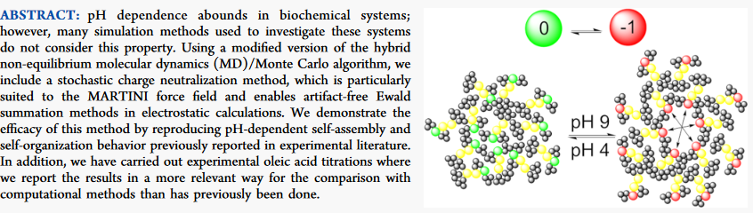

# Constant pH Coarse-Grained Molecular Dynamics with Stochastic Charge Neutralization - in NAMD

## Publication

Alexander van Teijlingen, Hamish W. A. Swanson, King Hang Aaron Lau, and Tell Tuttle
The *Journal of Physical Chemistry Letters* 2022 13 (18), 4046-4051
DOI: https://doi.org/10.1021/acs.jpclett.2c00544




## Description

A constant charge version of the NAMD constant pH software and associated tcl scripts.


NAMD source code modified according to: https://jeffcomer.us/downloads.html to allow for PME electrostatics with MARTINI, compile with GCC 8.2.0.


The constant pH TCL files were altered to allow for skipping of the cheap pre-switch evaluation step and force a switch attempt as well as adding a call to a python script which balances charge through a least modifications possible method.


## Common errors encoutered when using Constant pH Molecular Dynamics in NAMD

Something that looks like this:
``` tcl
FATAL ERROR: 
MOLECULE DESTROYED BY FATAL ERROR!  Use resetpsf to start over.
    while executing
"psfset resname $segid $resid $realName"
    (procedure "buildSystem" line 66)
    invoked from within
"buildSystem {*}$args"
    ("build" arm line 2)
    invoked from within
"switch -nocase -- $action {
        get {
            cphSystemGet {*}$args
        }
        set {
            cphSystemSet {*}$args
        }
      ..."
    (procedure "cphSystem" line 2)
    invoked from within
"cphSystem build [readConfig] $excludeList"
    (procedure "initialize" line 39)
    invoked from within
"initialize"
    (procedure "cphRun" line 6)
    invoked from within
"cphRun 5000 100000000"
    (file "CPHMD.inp" line 79)
```

Your atom labels in your psf file dont match exactly the atom labels in the atom labels in your cphConfigFile and/or topology .rtf file.


Something that looks like this:
``` tcl
FATAL ERROR: ERROR: failed to apply patch
MOLECULE DESTROYED BY FATAL ERROR!  Use resetpsf to start over.
    while executing
"patch [cphSystem get statePatch $segresidname] "$segid:$resid""
    (procedure "initializeSystem" line 34)
    invoked from within
"initializeSystem {*}$args"
    ("initialize" arm line 2)
    invoked from within
"switch -nocase -- $action {
        get {
            cphSystemGet {*}$args
        }
        set {
            cphSystemSet {*}$args
        }
      ..."
    (procedure "cphSystem" line 2)
    invoked from within
"cphSystem initialize $SystempH $temp $buildH $stateInfo"
    (procedure "initialize" line 80)
    invoked from within
"initialize"
    (procedure "cphRun" line 6)
    invoked from within
"cphRun 1000 30000 "
    (file "CPHMD.inp" line 108)
[Partition 0][Node 0] End of program
```

You are likely missing a MASS definition in your .rtf (in this case it is missing 'MASS 	-1  SP1y 45.0')
``` tcl
27   1

MASS	-1  P5C 	72.0
MASS	-1  SC4y	45.0 


!==============================================================================
! Tyrosine - states: D, 1 (1 = protonated)
!==============================================================================
PRES TYR1          0.00  !            - SI2
ATOM BAS   P5C     0.00  !    |     /   |
ATOM SI1   SC4y   0.00  !   BAS-SI1    |
ATOM SI2   SC4y   0.00  !    |     \   |
ATOM SI3   SP1y   0.00  !            - SI3
BOND  BAS SI1           !
BOND  SI1 SI2  SI1 SI3  SI2 SI3 !these should be constraints
BOND  BAS +BAS
ANGLE BAS SI1 SI2
ANGLE BAS SI1 SI3
ANGLE -BAS BAS SI1
ANGLE -BAS BAS +BAS
IMPR BAS SI2 SI3 SI1
DIHE -BAS BAS +BAS #BAS ! taking this out as it will end up linking to the next peptide
...

END
```

GLOBAL * COUNT

``` bash
BAD GLOBAL ANGLE COUNT(7199 INSTEAD OF 7200) ETC
```

In this specific example it means that the way your multicore processing has split up the box that 1/2 of the 3 atoms in a defined angle have move so far apart that the angle cannot be calculated. This is very unlikely to be because you have used too many cores, and far more likely to be that when you have regenerated your topology from your CpHMD .rtf file you have lost some of your bonds. Check the number of bonds in your namd.md.psf vs a regular non-CpHMD Box_psfgen.psf type topology and check they there is the same number of bonds and that these bonds are the same.